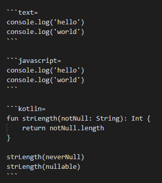

---

theme : "night"
transition: "slide"
highlightTheme: "monokai"
# logoImg: "logo.png"
slideNumber: true
title: "vscode-reveal template"

---

### vscode-reveal Template

<style>
pre {
  background: #303030;
  padding: 10px 16px;
  border-radius: 0.3em;
  counter-reset: line;
}
pre code[class*="="] .line {
  display: block;
  line-height: 1.8rem;
  font-size: 1em;
}
pre code[class*="="] .line:before {
  counter-increment: line;
  content: counter(line);
  display: inline-block;
  border-right: 3px solid #6ce26c;
  padding: 0 .5em;
  margin-right: .5em;
  color: #afafaf;
  width: 24px;
  text-align: right;
}

.reveal .slides > section > section {
  text-align:left; 
}

h1,h2,h3,h4 {
  text-align: center
}

p {
  text-align: center;
}

.present img {
    max-height: 65vh;
}
</style>

<script>

    window.onload = () => setTimeout(setLineNumber, 10)
    
    const setLineNumber = () => {
        const codeBlocks = document.querySelectorAll('pre code[class*="="]')
        codeBlocks.forEach(code => {
            const addLineSpan = code.innerHTML.trim().replaceAll('\n','</span><span class="line">')
            code.innerHTML = `<span class="line">${addLineSpan}</span>`    
        })
    }
    
</script>

---

show line number for the code block

add `'='`




---

show line number

```text=
console.log('hello')
console.log('world')
```

```javascript=
console.log('hello')
console.log('world')
```

```kotlin=
fun strLength(notNull: String): Int {
    return notNull.length
}

strLength(neverNull)
strLength(nullable)  
```

---

no line number

```text
console.log('hello')
console.log('world')
```

```javascript
console.log('hello')
console.log('world')
```

```kotlin
fun strLength(notNull: String): Int {
    return notNull.length
}

strLength(neverNull)
strLength(nullable)  
```

---

end

